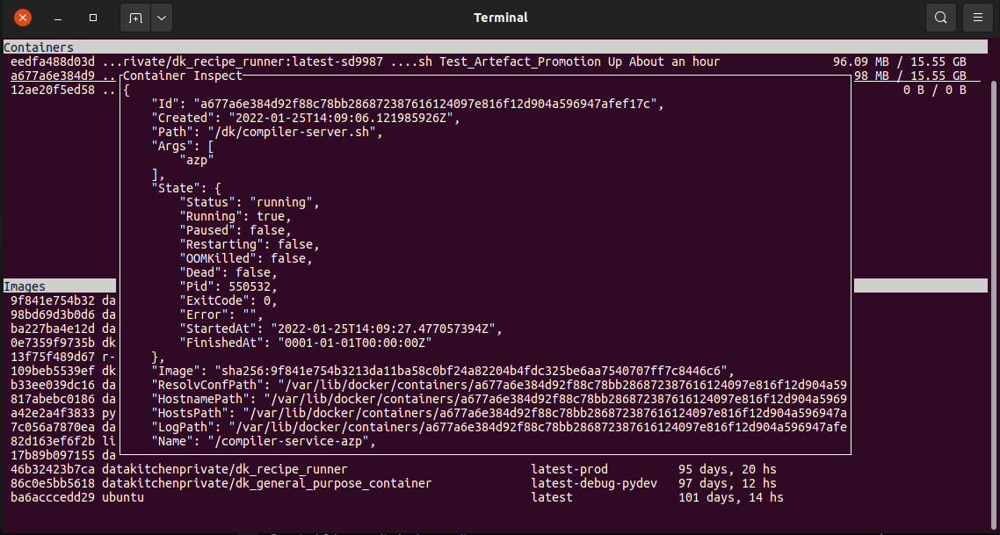

# clidockermgr
A CLI docker client made just as excuse for learning Go

Key bindings:

- ESC: Closes the active popup, or exits the application
- TAB: Cycles focus across views

Containers:

- v: View container details
- s: Opens a shell in an active container
- l: View container logs
- k: Kill a container
- delete: Deletes a container

Images:

- v: View image details
- delete: Deletes an image
